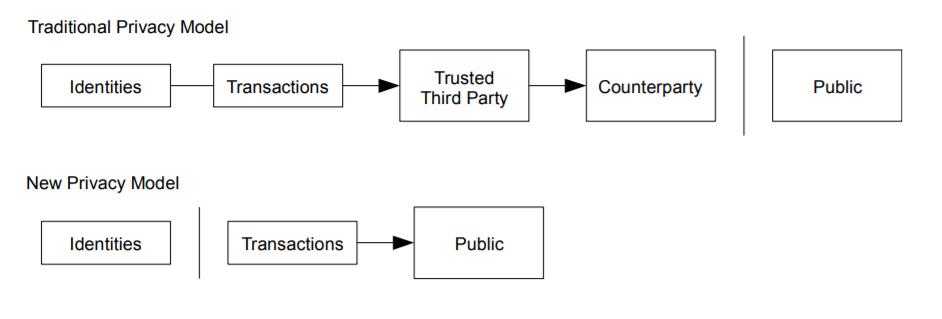

# 10. プライバシー
伝統的なバンキングモデルは、関連する当事者や信頼できる第三者の情報へのアクセスを制限することでプライバシーレベルを達成する。  
全てのトランザクションを公表する必要があるため上記の方法は排除されるが、他の部分で情報のフローを破壊する(公開鍵を匿名にする)ことによりプライバシーを維持することができる。  
一般の人は、「誰か」がある量の通貨を他の「誰か」に送付しているのを知ることができる。しかしその情報には、トランザクションからその「誰か」にリンクする情報は含まれない。  
これは証券取引所が発行する情報のレベルに似ている。そこでは個人取引の時間と規模を記録したtapeというものが公表されるが、その当事者が何者かを知ることはできない。

 

 

追加のファイアウォールとして、各トランザクションが共通の管理者にリンクしてしまうのを防ぐために新規の鍵のペアが必要となる。  
いくつかのリンクは複数入力による、各入力が同じ管理者によるものであることを明らかにしているトランザクションを避けることができない。  
リスクとして、仮に鍵の管理者が判明してしまうと、リンクによって同じ管理者に属するその他のトランザクションも判明してしまう可能性がある。