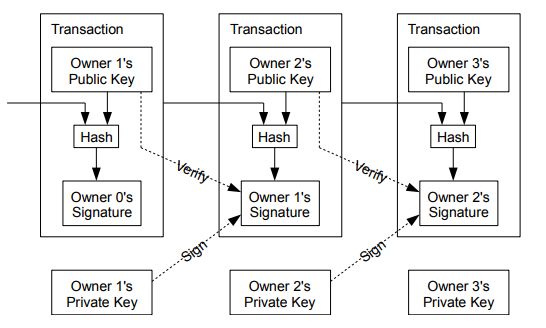

# 2. 取引

電子コインは、デジタル署名のチェーンとして定義される。電子コインの各所有者は、前の取引のハッシュと次の所有者の公開鍵をデジタル署名で、これらをコインの最後に追加することによって、コインを次の取引先に転送する。
受取人はその流れの署名を検証して所有権のチェーンを検証することができる。

もちろん、問題は、受取人が所有者の1人がコインを二重に消費していないことを確認できないことである。一般的な解決方法は、信頼できる中央機関、すなわち造幣局を導入し、重複支出をすべての取引でチェックすることだ。各取引の後、コインは造幣局に戻って新しいコインを発行しなければならず、造幣局から直接発行されたコインのみが二重使用されないことを信用される。この解決策の問題点は、金融システム全体の運命は、銀行と同じように、すべての取引が通過しなければならない造幣局を運営する企業に依存するということである。
必要なのは、コインの受取人に前の所有者が以前の取引に署名(二重署名)していないことを知らせる方法である。この目的からするに、最も早い取引が重要な取引であるため、後の二重支出を使用することについては気にしないこととする。
取引がなかったことを確認する唯一の方法は、全ての取引を認識することだ。造幣局ベースのモデルでは、造幣局は全ての取引を認識しており、最初に到着したものを決定していた。これを信用できる機関なしで達成するには、取引を公表しなければならず、参加者が受領した注文の単一の履歴に同意するシステムが必要である。受取人は各取引の時点で、大部分のノードがそれが最初に受け取られたことに賛同したという証明を必要とする。