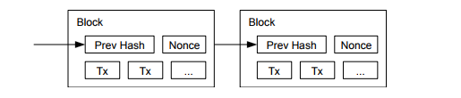

# 4. Proof-of-Work(作業証明)

ピア・ツーピアを基本とした分散型タイムスタンプサーバーを実装するためには、新聞やUsenetの投稿ではなく"Adam Back's Hashcash [6]"と類似したProof-of-Workシステムを用いなければならない。  
Proof-of-Workシステムは、SHA-256等を用いてハッシュ化された0ビット値で始まる値を検査することと関係している。  
必要となる標準的な作業量は、必要となる0ビット値の数に対して指数関数的であり、単一のハッシュを実行することで検証することができる。  
タイムスタンプ・ネットワークでは、"ブロックのハッシュ値に対して必要な0ビットを与える"値が見つかるまで、ブロック内のノンス値をインクリメントしてProof-of-Workを実装する。一度CPUの労力によってProof-of-Workを満足させると、そのブロックは作業をやり直すことなく変更することはできない。さらに後続にブロックが連鎖すると、そのブロックを変更するためには後続のすべてのブロックへの作業をやり直さなければならない。
  
 

 

Proof-of-Workはまた、多数決における表現決定の問題も解決する。  
仮に多数決が「1IPアドレスにつき1票」を基本としている場合、大量のIPアドレスを割り当てることのできる人間によってその仕組みが腐敗させられてしまう可能性がある。  
Proof-of-workは本質的に「1CPUにつき1票」である。
多数決は最も労力が注がれた最長のチェーンによって表現される。
全CPUパワー中の大部分が信頼できるノードによって制御される場合、その信頼できるチェーン他の競合するチェーンをしのぐ速さで成長する。  
過去のブロックを改変するためには、攻撃者はproof-of-workを該当ブロック以降全てについてやり直し、信頼できるノードの処理に追いつき、追い越さなければならない。  
後で説明するが、スピードの遅い攻撃者が信頼できるノードの処理に追いつく可能性は、後続のブロックが追加されるたびに指数関数的に減少する。  
時代の変化によるハードウェアの処理速度増加および実行中ノードにおける利益の変化を補うために、proof-of-workの難易度は1時間当たりの平均ブロック数を指標とする移動平均値によって決定する。
ブロックが早く生成されるのであれば、それに応じて難易度も上昇する。
