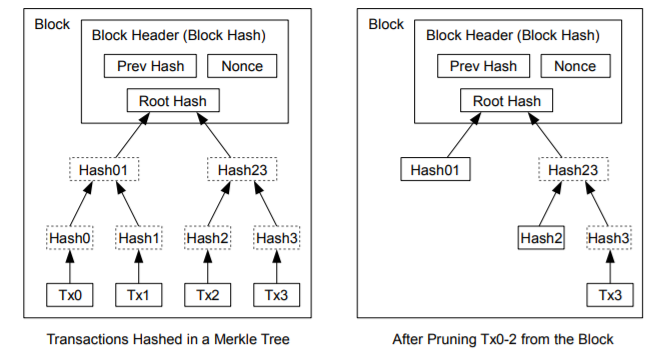

# 4. ディスク容量の再利用
一度コインのトランザクションが十分な数のブロック内に埋め込まれると、ディスク容量を確保するために過去のトランザクションを破棄することがある。  
以上をブロックのハッシュを壊さずに容易にするために、トランザクションは"Merkle Tree [7][2][5]"でハッシュされ、そのルートのみがブロックのハッシュに含まれる。
古いブロックは、木の枝を切り落とすことによってコンパクトにすることができる。内部のハッシュを保存しておく必要はない。

 

 
