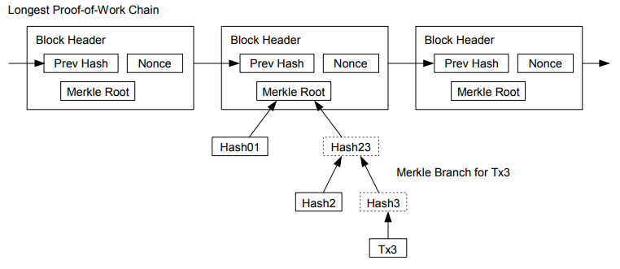

# 8.簡略化支払検証

完全なネットワークノードを実行することなく支払いを確認することは可能である。
ユーザーは、ネットワークノードに問い合わせることによって得ることができる、最も長い作業証明連鎖のブロックヘッダーのコピーを保持するだけで、そのブロックにタイムスタンプされた取引をブロックにリンクするマークル・ブランチを取得できるからだ。
ユーザーはその取引を確認できないが、そのマークる・ブランチをチェーン内の場所にリンクすることで、ネットワークノードがそれを受け入れたことを知ることができ、その後ブロックが追加されていくことでさらなる確認を行うことができる。

したがって、良心的なノードがネットワークを制御する限り、検証は信頼できるものの、ネットワークが攻撃者によって圧倒された場合、より脆弱になる。ネットワークノードは自分自身で取引を検証できますが、簡略化された方法は、攻撃者がネットワークを圧倒し続けることができる限り、攻撃者が作成した取引によってだまされる可能性がある。
これを防ぐための1つの対処法は、不正なブロックを検出したときにネットワークノードからのアラートを受信し、受信した際は、ユーザーのソフトウェアが完全なブロックとアラートされた取引をダウンロードし、矛盾を確認する取引を警告することです。頻繁な支払いが発生している企業は、より独立したセキュリティと迅速な検証のために、独自のノードを運用するのがいいだろう。

